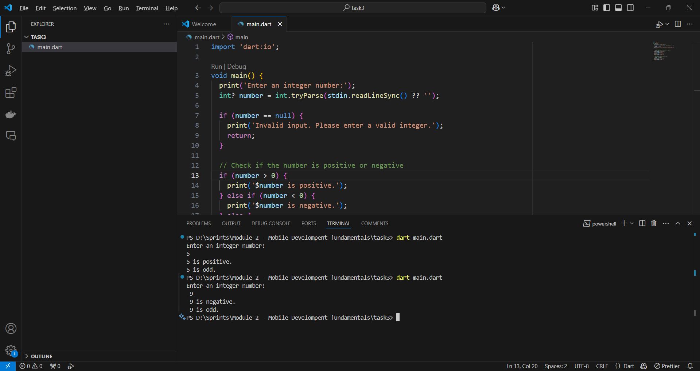

## Programing by Dart - Control Flow - Check any number positive or negative and even or odd

**Task General Description**

Check any number positive or negative and even or odd using conditions and  
different operators

**Requirement 1**

**Title:** Check any number positive or negative and even or odd  
**Description:** Enter any integer number  
Use the condition to check it's positive or negative, then  
use the condition to check if it's even or odd

    void main() {
      List<int> numbers = [1, 2, 3, 4, 5, 6, 7, 8, 9, 10];
    
      for (int number in numbers) {
        switch (number % 2) {
          // if number is divisible by 2 it's even
          case 0:
            print('$number is even');
            break;
          case 1:
            print('$number is odd');
            break;
          default:
            print('Invalid number'); // handle default case
        }
      }
    }

**Screenshots of output**
